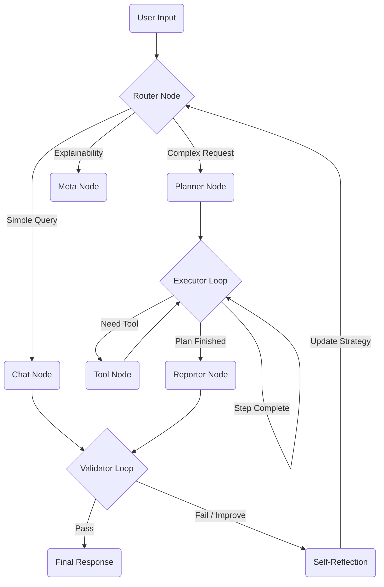

<div align="center">

# 🧠 ISEA v2.0 PRO
### Introspective Self-Evolving Autonomous Agent

[](https://opensource.org/licenses/MIT)
[](https://www.python.org/downloads/)
[](https://langchain-ai.github.io/langgraph/)
[](https://nextjs.org/)
[]()

<p align="center">
  <strong>Decides. Acts. Reflects. Evolves.</strong><br>
  A production-grade autonomous system that moves beyond simple prompting to demonstrate <br>
  <strong>graph-based reasoning, self-correction, and human-in-the-loop control.</strong>
</p>

[View Demo](#) • [Report Bug](https://github.com/AnmollCodes/Research-AI-Agent/issues) • [Request Feature](https://github.com/AnmollCodes/Research-AI-Agent/issues)

</div>

---

## 🚀 The Paradigm Shift

Most AI projects today follow a linear path:  
`Prompt` → `LLM` → `Response`

**ISEA v2.0 breaks this mold.** It is designed to answer a deeper engineering question:
> _"How do we build an AI that can decide WHAT to do, evaluate its OWN performance, and improve WITHOUT human intervention?"_

This is **not a chatbot**. It is a **Reasoning Engine**.

---

## ⚡ What Makes This Unique?

| Feature | Typical Chatbot | 🧠 ISEA Agent |
|:---|:---:|:---:|
| **Control Flow** | Linear Script | **Dynamic Graph (DAG)** |
| **Tool Usage** | Hardcoded / Forced | **Decision-Driven** |
| **Logic** | "Always Answer" | **"Think, Plan, Execute"** |
| **Self-Correction** | ❌ None | **✅ Post-Run Reflection** |
| **Visibility** | Black Box | **✅ Live Neural Visualization** |
| **Safety** | ❌ None | **✅ Human-in-the-Loop Gate** |

---

## 🏗️ Architecture & Neural Flow

The system operates on a stateful graph where each node represents a distinct cognitive function.



### 🧠 Core Nodes
1. **Router**: analyzing intent (Research vs. Chat vs. Explanation).
2. **Planner**: Decomposes complex goals into executable steps.
3. **Executor**: The "Agent" that uses tools (Search, Math, Code) to solve steps.
4. **Validator**: Critiques the output for accuracy and safety.
5. **Human Gate**: Intercepts sensitive actions (like saving files) for approval.

---

## 🎨 Immersive Visualization

We believe AI reasoning shouldn't be hidden. ISEA features a **cyberpunk-inspired dashboard** that exposes the agent's "brain" in real-time.

### 🖥️ Dashboard Features
- **Live Graph State**: Watch nodes light up as the agent "thinks".
- **Real-Time Telemetry**: Monitor token usage, latency, and context window.
- **Thought Stream**: See the raw internal monologue and decision paths.
- **Glassmorphism Spec**: Built with modern Tailwind + Framer Motion for a premium feel.

---

## 🛠️ Technology Stack

### Backend Impl.
- **Core Logic**: Python 3.10+
- **Orchestration**: LangGraph, LangChain
- **Intelligence**: Google Gemini 2.0 Flash / OpenAI GPT-4o
- **Search**: Tavily AI Search

### Frontend Impl.
- **Framework**: Next.js 15 (App Router)
- **Styling**: TailwindCSS v4 + Glassmorphism
- **Animations**: Framer Motion
- **3D Elements**: Three.js / React Three Fiber

---

## 🚦 Getting Started

### Prerequisites
- Python 3.10+
- Node.js 18+
- API Keys: Google Gemini (or OpenAI), Tavily

### Installation

1. **Clone the Repository**
   ```bash
   git clone https://github.com/AnmollCodes/Research-AI-Agent.git
   cd Research-AI-Agent
   ```

2. **Backend Setup**
   ```bash
   python -m venv venv
   # Windows
   .\venv\Scripts\activate
   # Mac/Linux
   source venv/bin/activate
   
   pip install -r requirements.txt
   ```

3. **Frontend Setup**
   ```bash
   cd frontend
   npm install
   ```

4. **Environment Variables**
   Create a `.env` file in the root:
   ```env
   GOOGLE_API_KEY=your_key_here
   TAVILY_API_KEY=your_key_here
   ```

5. **Run the System**
   ```bash
   # Terminal 1 (Backend)
   python api.py
   
   # Terminal 2 (Frontend)
   cd frontend
   npm run dev
   ```

Access the dashboard at `http://localhost:3000`.

---

## 🔮 Roadmap & Future Vision

- [ ] **Long-Term Memory**: Vector database integration (Pinecone/Chroma) for persistent context.
- [ ] **Multi-Modal Support**: Image analysis and generation nodes.
- [ ] **Swarm Mode**: Coordination between multiple specialized sub-agents.
- [ ] **Voice Interface**: Real-time voice interaction layer.

---

## 🤝 Contributing

Contributions are what make the open-source community such an amazing place to learn, inspire, and create. Any contributions you make are **greatly appreciated**.

1. Fork the Project
2. Create your Feature Branch (`git checkout -b feature/AmazingFeature`)
3. Commit your Changes (`git commit -m 'Add some AmazingFeature'`)
4. Push to the Branch (`git push origin feature/AmazingFeature`)
5. Open a Pull Request

---

<div align="center">

### Built with ❤️ and 🧠 by Anmol Agarwal

[LinkedIn](https://www.linkedin.com/in/anmol-agarwal25) • [Twitter](https://twitter.com/AgarwalA25) • [GitHub](https://github.com/AnmollCodes)

</div>
